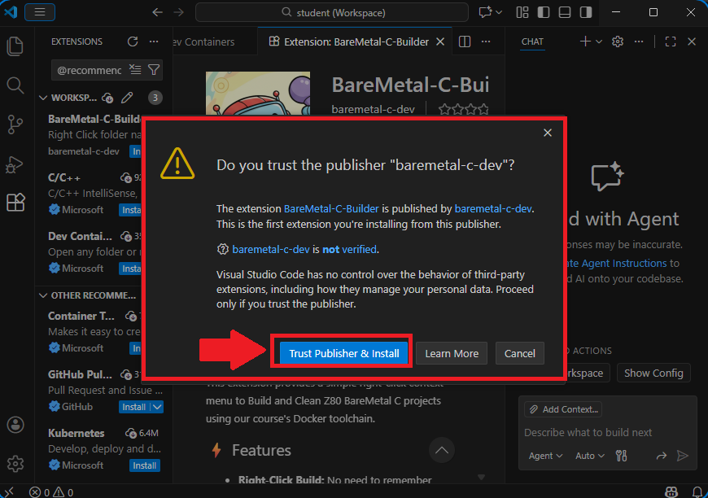
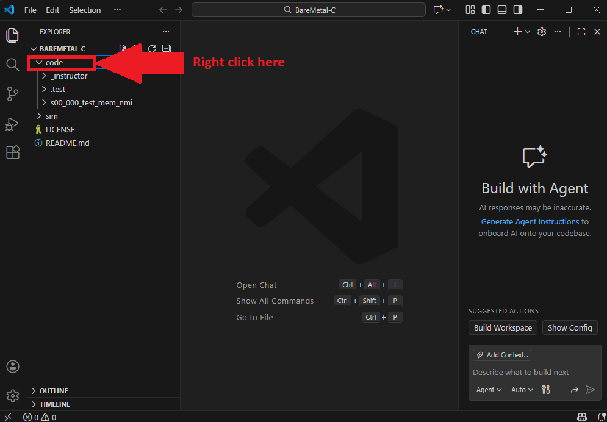
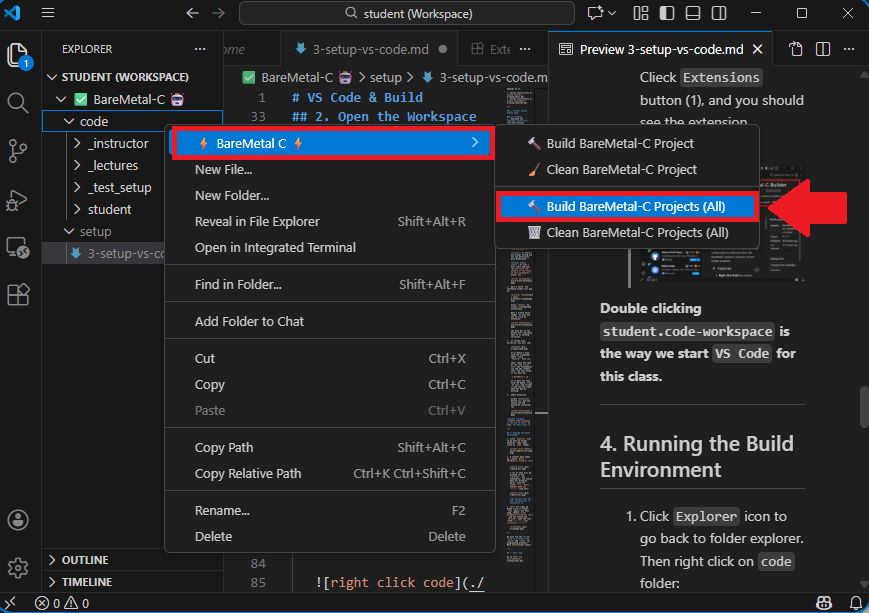
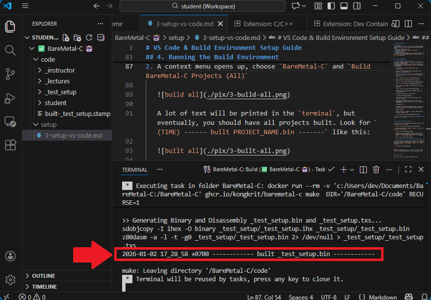
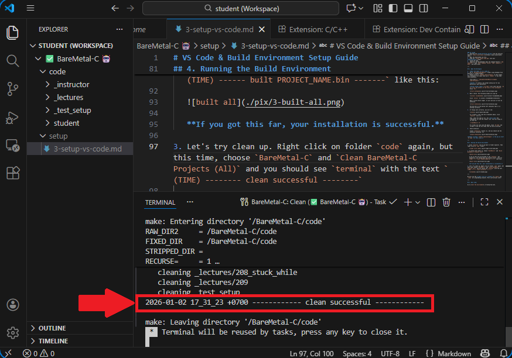

# VS Code & Build Environment Setup Guide

This guide will help you set up Visual Studio Code (VS Code) and configure it to work with your Docker-based build environment.

## 0. Prerequisites: Tools and SimulIDE installation

Before setting up VS Code, ensure the tools (which includes *GitHub Desktop* and *Docker Desktop*) and *SimulIDE* are installed and running, as VS Code depends on it.

1. Follow instructions to [setup tools](./1-setup-tools.md).
2. Follow instructions to [setup SimulIDE](./2-setup-simulide.md).

---

## 1. Install Visual Studio Code

### For Windows
1.  Download the **Windows installer** from the official website: [code.visualstudio.com](https://code.visualstudio.com/).
2.  Run the installer (`VSCodeUserSetup-{version}.exe`).
3.  Follow the prompts. **Important:** On the "Select Additional Tasks" screen, *check all 4 boxes*. The last box says: **"Add to PATH (requires shell restart)"**.

    
5.  Click **Install**.

### For macOS
1.  Download the **macOS Universal build** from the official website: [code.visualstudio.com](https://code.visualstudio.com/).
2.  Open the downloaded zip file.
3.  Drag the `Visual Studio Code.app` into your **Applications** folder.
4.  Launch VS Code.
5.  (Optional but Recommended) Open the Command Palette (`Cmd+Shift+P`), type `Shell Command: Install 'code' command in PATH`, and press Enter.

---

## 2. Open the Workspace

1.  **Quit *VS Code* if it is open.**
2.  Go it `Documents/BareMetal-C` folder using *Windows File Explorer* or *macOS Finder*.
3.  Double click on `student.code-workspace` on that folder. This workspace file *may* show up as `student` if you hide file extension).
   
    (full path is `~/Documents/BareMetal-C/student.code-workspace`)

    **macOS:** If there's any prompt asking you for any permission, give permission.

    **Visual Studio Code** (`VS Code`) will start and ask: `Do you trust the authors of the files in this workspace?`. Click `Yes`.

    

4.  Wait a while. The following window will pop up:

    

    Click `Install` to install *recommended extensions*.

    Wait a little while longer. It will ask you to trust my extension.

    

    The blue bar on the bottom left indicates that it is working correctly.

5.  If things work correctly, you will see:

    

    If it doesn't look like the screenshot above, click `Explorer` Icon (1).
    
    Then, check the name at (2). You **must see** the *checkmark* (✅) and the *robot* (🤖). The full thing in (2) must be:

    `✅ BareMetal-C 🤖`

    If it does not look like the above, close `VS Code` and re-open it and see the steps that you may be missing.

6.  Check extension:

    Clieck `Extensions` button (1), and you should see the extension installed. (2)

    

**Double clicking `student.code-workspace` is the way we start `VS Code` for this class.**

---

## 4. Running the Build Environment

1. Click `Explorer` icon to go back to folder explorer. Then right click on `code` folder:

   

2. A context menu opens up, choose `BareMetal-C` and `Build BareMetal-C Projects (All)`

   

   A lot of text will be printed in the `terminal`, but eventually, you should have all projects built. Look for `(TIME) ------ built PROJECT_NAME.bin -------` like this:

   

   **If you got this far, your installation is successful.**

3. Let's try clean up. Right click on folder `code` again, but this time, choose `BareMetal-C` and `Clean BareMetal-C Projects (All)` and you should see `terminal` with the text `(TIME) -------- clean successful --------`

   

---

We will use the **right click on a folder** to `build` and `clean` our programming projects. More instructions later!

---

## 5. Next step:

Go to [test the environment](./4-setup-test.md).
