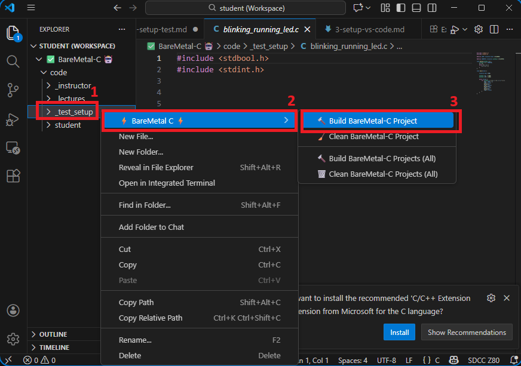

# Testing everything:

This guide ensures that you install everything correctly and is ready for class.

---

## 0. Prerequisites

You must have installed the following:
- [tools](./1-setup-tools.md)
- [simulide](./2-setup-simulide.md)
- [vs code](./3-setup-vs-code.md)

---

## 1. Build test code

- Run `VS Code`. Check that you are at the *Explorer* (1) and you see `✅ BareMetal-C 🤖`.

  If you don't, click `File` and select `Open Workspace from File...` and choose `student.code-workspace`.

  

  **IMPORTANT:** Things won't work if you don't see `✅ BareMetal-C 🤖` (2). Double-check!

- Go to folder `_test_setup` and right click. Choose `BareMetal-C` and `Build BareMetal-C Project`

   

- The project should be built, as seen below by
  ```
  YYYY-MM-DD HH_MM_SS +ZZZZ ----- built _test_setup.bin -----
  ```
   
  If not, check your *tools* and *VS code* setup.

  

---

## 2. Load test code into circuit:

- Open `simulide` and click `open circuit` in screenshot below:

  

  Go to `BareMetal-C/sim` folder and choose `05_freq_200kHz.sim1` file.

- You should see the circuit below:

  

  If the stuff in *red rectangle box* is missing, go back to set `User Data Folder`. See instructions in [setting up simulide](./2-setup-simulide.md).

- Right click on `ROM` (`1`) and select `Load data` as in screenshot below:

  

- In folder `BareMetal-C/sim`, choose file `_test_setup.bin`

- Click `Start/Stop Simulation` and watch the blinking, running lights:

  

---

## 3. Troubleshooting

- When starting VS Code, you **must** see `✅ BareMetal-C 🤖` while in *Explorer*.

- If you don't see `✅ BareMetal-C 🤖`, click `File` and select `Open Workspace from File...` and choose `student.code-workspace`.

  - If you open another folder, even if it's inside `BareMetal-C`, like `BareMetal-C/code`, the *right click* menu may not show up.

- You must *right click* on a **folder** to see *Build BareMetal-C Project*.

  - Right clicking on a file will not show `BareMetal-C` *Build* or *Clean* options.

- Click `Start/Stop Simulation` to toggle simulation on and off.

- There are other things you can do with *right click* on a *folder* as well. There are `Build`, `Build All`, `Clean`, and `Clean All`.

  Feel free to right click them. They won't destroy your project.

---

## 4. Wrap-up

If you got the running-blinking lights working, everything is working correctly.

- VS Code can communicate with the tools.
- The tools can compile and link code.
- The compiled code can be run on SimulIDE

---

Go back to [home page](../README.md)
